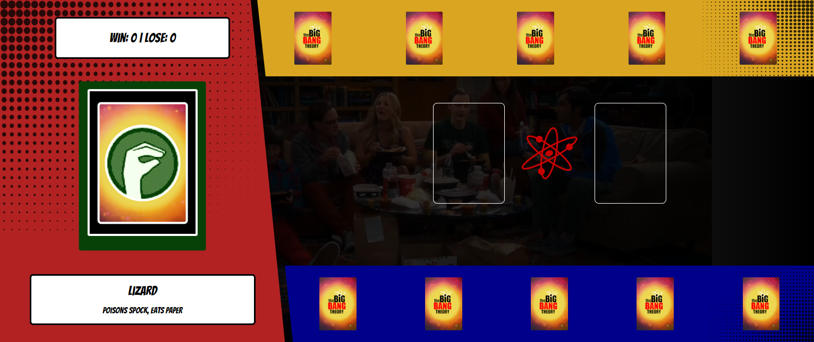

# Jo-ken-po TBBT Edition

Um jogo de **Jo-ken-po** (Pedra, Papel e Tesoura) com temática **The Big Bang Theory**, criado com o objetivo de explicar conceitos de **lógica de programação aplicados a jogos**.

> Projeto baseado no curso **“Criando um Jogo de Cartas do Yu-Gi-Oh! com JavaScript e CSS”** do **Felipe Aguiar**, desenvolvido durante o **Bootcamp Santander Fullstack - Trilha Front-End**.  
> Personalizado com as regras do jogo **Rock-Paper-Scissors-Lizard-Spock**, apresentado na série **The Big Bang Theory**.

## Conceitos Abordados

- **Armazenamento e gerenciamento de estado manual**
- **Funções puras e limpas**
- **Organização e separação de responsabilidades no código**

## Regras do Jogo

O jogo segue as regras do **Rock-Paper-Scissors-Lizard-Spock**, que é uma expansão do clássico Jo-ken-po, com cinco opções:

- Pedra  
- Papel  
- Tesoura  
- Lagarto  
- Spock

Cada escolha vence de duas e perde para duas. As regras são:

- Tesoura corta Papel  
- Papel cobre Pedra  
- Pedra esmaga Lagarto  
- Lagarto envenena Spock  
- Spock quebra Tesoura  
- Tesoura decapita Lagarto  
- Lagarto come Papel  
- Papel refuta Spock  
- Spock vaporiza Pedra  
- Pedra quebra Tesoura  


## Tecnologias Utilizadas

- **HTML5**
- **CSS3**
- **JavaScript (ES6+)**

## Preview do Projeto



## Como visualizar
### Versão Online

Você pode jogar diretamente no navegador pelo GitHub Pages:  
[https://leticia-farias.github.io/dio-js-yugioh-assets/](https://leticia-farias.github.io/dio-js-yugioh-assets/)

### Executar Localmente  
1. Clone o repositório:
   ```bash
   git clone https://github.com/leticia-farias/dio-desafio-css-responsividade.git

2. Acesse a pasta do projeto:
   ```bash
   cd dio-desafio-css-responsividade
3. Abra o arquivo `index.html` no seu navegador:
- Pelo explorador de arquivos, clicando duas vezes no arquivo;  
- Ou pelo terminal, usando um dos comandos abaixo conforme seu sistema:
  - Windows:
    ```bash
    start index.html
  - macOS:
    ```bash
    open index.html
  - Linux:
    ```bash
    xdg-open index.html

## Créditos e Fontes

**Imagens, vídeos e áudios utilizados no projeto:**

| Tipo     | Fonte                        | Link                                                                                       |
|----------|------------------------------|--------------------------------------------------------------------------------------------|
| Imagem   | Wikipedia                    | _[https://en.wikipedia.org/wiki/File:The_Big_Bang_Theory_(Official_Title_Card).png]_       |
| Imagem   | Wikimedia Commons            | _[https://commons.wikimedia.org/wiki/File:The_Big_Bang_Theory-Logo.png]_                   |
| Imagem   | Logos-World                  | _[https://logos-world.net/the-big-bang-theory-logo/]_                                      |
| Imagem   | Centro da Galaxia            | _[https://blogcentrodagalaxia.blogspot.com/2015/07/pedra-papel-tesoura-lagarto-spock.html]_|
| Imagem   | PNG Arts                     | _[https://www.pngarts.com/pt/explore/232885]_                                              |
| Áudio    | 20th Century Studios Fan 2020| _[https://youtu.be/Qwcm3vk_KzY?si=liexatgAOZc_Je3k]_                                       |
| Vídeo    | Cortes de Nerd               | _[https://youtu.be/3ZkcFEosrsI?si=fxMfVI678RHlSxfE]_                                       |

> **Este projeto é para fins educacionais e sem fins lucrativos.**  
> Todos os direitos das mídias utilizadas pertencem aos seus respectivos autores.

##  Licença

Este projeto é de uso **educacional e pessoal**.  
Sinta-se à vontade para estudar, modificar e compartilhar — com os devidos créditos.
